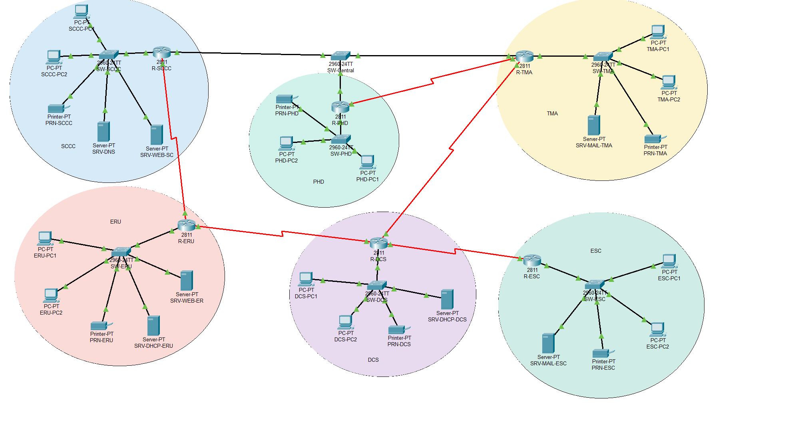

# Smart Bangladesh Digital City Network

A six-department government network designed and implemented in **Cisco Packet Tracer** for
**CSE421 — Computer Networks**, Department of Computer Science and Engineering,
BRAC University. Group 01.

The brief: connect six departments into one routed infrastructure with VLSM addressing,
a mix of dynamic and static routing, centralised DNS, two web servers, two mail servers
with cross-domain delivery, three different DHCP mechanisms, and a demonstrable
backup route that activates when the primary path fails.



---

## Repository contents

| File                                          | What it is                                                                                                    |
| --------------------------------------------- | ------------------------------------------------------------------------------------------------------------- |
| `project.pkt`                                 | The Packet Tracer network. This is the main deliverable.                                                      |
| `SBDC_Report.tex` / `.pdf`                    | Design and implementation report: assumptions, VLSM, addressing tables, every configuration command.          |
| `SBDC_Work_Distribution.tex` / `.pdf`         | Which member worked on which implementation phase.                                                            |
| `SBDC_Implementation_Plan.html`               | The working build plan used during implementation: task board, failover analysis, gotchas. Open in a browser. |
| `topology_logical.png`                        | Labelled topology export used in the report.                                                                  |
| `pings/`                                      | Ping test evidence, one folder per department.                                                                |
| `Project_Details.md`                          | The original assignment brief, transcribed.                                                                   |
| `8_Smart Bangladesh Digital City Network.pdf` | The original assignment brief as issued.                                                                      |

---

## Network at a glance

**Base network: `11.8.0.0/16`** — derived from student ID `22201108`, last four digits
`1108`, split into the pairs `11` and `08`.

38 devices: 6 routers (Cisco 2811), 7 switches, 12 PCs, 6 printers, 7 servers.

### Address plan

| Subnet                 | Network                           | Hosts needed | Usable |
| ---------------------- | --------------------------------- | -----------: | -----: |
| SCCC LAN               | `11.8.0.0/23`                     |          320 |    510 |
| DCS LAN                | `11.8.2.0/23`                     |          260 |    510 |
| PHD LAN                | `11.8.4.0/24`                     |          220 |    254 |
| TMA LAN                | `11.8.5.0/24`                     |          180 |    254 |
| ESC LAN                | `11.8.6.0/24`                     |          140 |    254 |
| ERU LAN                | `11.8.7.0/25`                     |          100 |    126 |
| Central switch segment | `11.8.7.128/29`                   |            3 |      6 |
| 5 serial WAN links     | `11.8.7.136/30` … `11.8.7.152/30` |       2 each | 2 each |

`11.8.8.0` onward is left unallocated for growth.

> DCS needs a `/23`, not a `/24`. 260 hosts against 254 usable addresses is six short —
> the sizing trap in this brief.

### Topology

SCCC, TMA and PHD share one central switch. Every other inter-router link is
point-to-point serial: SCCC–ERU, ERU–DCS, DCS–TMA, DCS–ESC and PHD–TMA.

Redundancy comes from the ring `SCCC → ERU → DCS → TMA → central switch → SCCC`.

### Routing

| Router | Protocol                | Static route style                                              |
| ------ | ----------------------- | --------------------------------------------------------------- |
| R-SCCC | RIPv2 + static (hybrid) | Next-hop, one floating at AD 130, plus `redistribute static`    |
| R-TMA  | RIPv2                   | Nine floating static routes via DCS at AD 130                   |
| R-PHD  | RIPv2                   | None                                                            |
| R-ERU  | Static only             | Next-hop to every remote network                                |
| R-DCS  | Static only             | Directly connected — exit interface only, never fully specified |
| R-ESC  | Static only             | One default static route toward DCS                             |

### Services

| Service                              | Host              | Address      |
| ------------------------------------ | ----------------- | ------------ |
| DNS (all zones)                      | SRV-DNS, SCCC     | `11.8.1.250` |
| `www.smartcity.gov.bd`               | SRV-WEB-SC, SCCC  | `11.8.1.251` |
| `www.emergency.gov.bd`               | SRV-WEB-ER, ERU   | `11.8.7.120` |
| `mail.tma.gov.bd`                    | SRV-MAIL-TMA, TMA | `11.8.5.250` |
| `mail.esc.gov.bd`                    | SRV-MAIL-ESC, ESC | `11.8.6.250` |
| DHCP — router pools (SCCC, TMA, PHD) | R-SCCC            | `11.8.7.129` |
| DHCP — server pools (DCS, ESC)       | SRV-DHCP-DCS      | `11.8.2.250` |
| DHCP — server pool (ERU)             | SRV-DHCP-ERU      | `11.8.7.121` |

TMA, PHD and ESC reach their DHCP source through `ip helper-address`.

---

## Failover demonstration

During normal operation TMA reaches everything through SCCC via the central switch,
using RIP routes at administrative distance 120.

Shut `FastEthernet0/1` on R-TMA and the RIP routes are purged instantly. The floating
static routes at distance 130 drop into the table and traffic reroutes:

```
TMA -> DCS -> ERU -> SCCC
```

A `tracert` from TMA-PC1 to `11.8.1.251` shows four hops
(`11.8.5.1`, `11.8.7.145`, `11.8.7.141`, `11.8.7.137`) instead of two.

Allow about 40 seconds after the failure before testing end to end. SCCC's own port
stays up, so its return route has to age out of RIP first — hence the tuned
`timers basic 10 30 30 40` on all three RIP routers.

---

## Three things that are easy to get wrong

**The PHD–TMA link is deliberately kept out of RIP.** The brief requires that link _and_
requires failover to go through DCS. If RIP runs across it, TMA just relearns everything
from PHD at AD 120 and the floating static never activates. Both ends are declared
`passive-interface`, so the link stays cabled and pingable while carrying no routing
information.

**Cross-domain email needs bare-domain DNS records.** Packet Tracer has no MX record
type, so a mail server relaying to another domain does a plain A lookup on the bare
domain. `tma.gov.bd` and `esc.gov.bd` must resolve, not just `mail.tma.gov.bd` and
`mail.esc.gov.bd`. Both mail servers also need `11.8.1.250` set as their own DNS server.

**ERU routes the TMA LAN through DCS, not through SCCC.** ERU is static-only and cannot
see a failure three hops away. Pointing it at SCCC would create a two-router loop during
failover; pointing it at DCS is correct in both states.

---

## Working with this repository

### Opening the network

Open `project.pkt` in Cisco Packet Tracer 8.x. All devices use the naming convention
`R-*` for routers, `SW-*` for switches, `SRV-*` for servers and `PRN-*` for printers.

Router and mail credentials are laboratory values: `enable secret cisco123`,
line password `cisco`, mail account password `cisco123`.

### Building the documents

Both `.tex` files compile with pdfLaTeX. Run twice so cross-references resolve:

```sh
pdflatex SBDC_Report.tex
pdflatex SBDC_Report.tex

pdflatex SBDC_Work_Distribution.tex
pdflatex SBDC_Work_Distribution.tex
```

Member names and IDs in `SBDC_Work_Distribution.tex` live in the `\memA` / `\idA` macros
at the top of the preamble — edit them there and the cover and all tables follow.

### Ping evidence

`pings/<DEPARTMENT>/` holds the ping screenshots taken from that department. The empty
`.txt` file in each folder marks who captured that set:

| Folder                    | Captured by |
| ------------------------- | ----------- |
| `pings/SCCC`, `pings/ERU` | Nazah       |
| `pings/PHD`, `pings/DCS`  | Saadat      |
| `pings/TMA`, `pings/ESC`  | Jabir Safa  |

SCCC, PHD, DCS and TMA each have five screenshots covering every other department —
20 directed pairs in total, which evidences connectivity across all six departments.
The ERU and ESC folders currently hold only the ownership marker.

---

## Team

| Member               | Student ID | Required setup configured |
| -------------------- | ---------- | ------------------------- |
| Jabir Safa Khandoker | 22201108   | DHCP, Dynamic Routing     |
| Md. Saadat Rahman    | 22201101   | Static Routing            |
| Nazah S. Anis        | 22201105   | Email                     |

Work was divided across six implementation phases — design, topology build, addressing,
DHCP, routing, and servers and services. `SBDC_Work_Distribution.pdf` records which
phases each member worked on.
